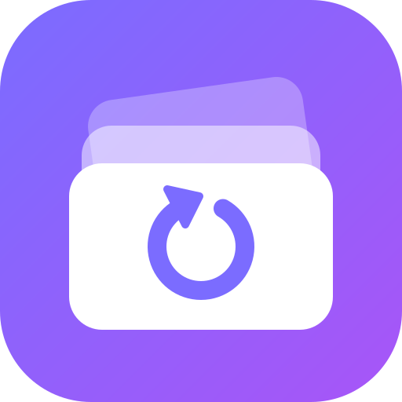
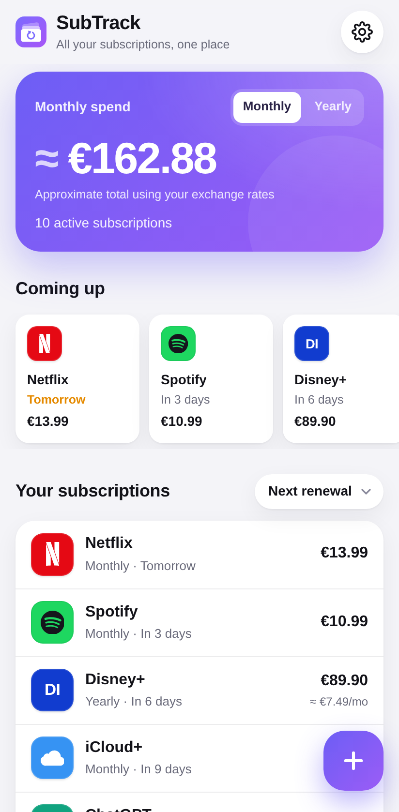
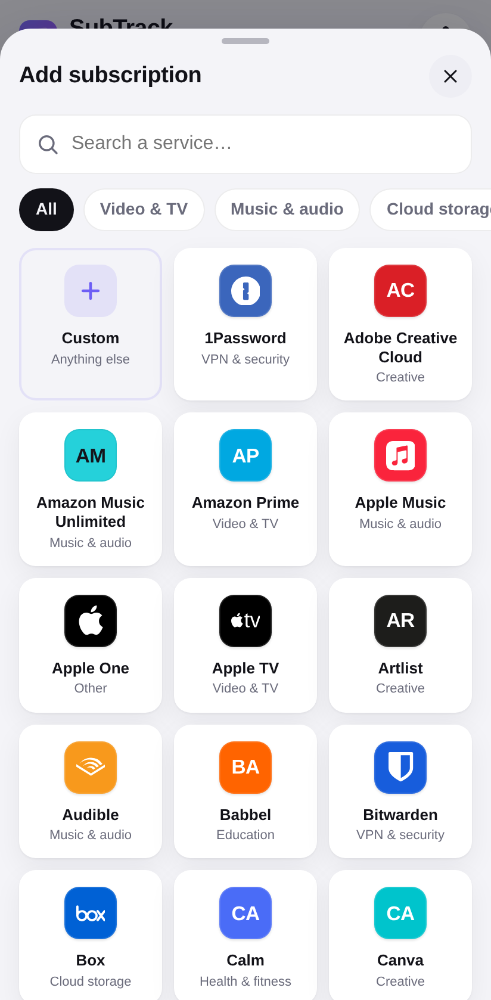
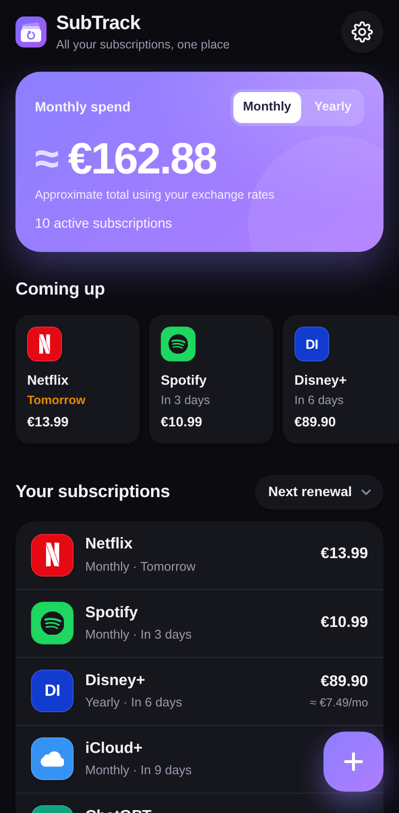
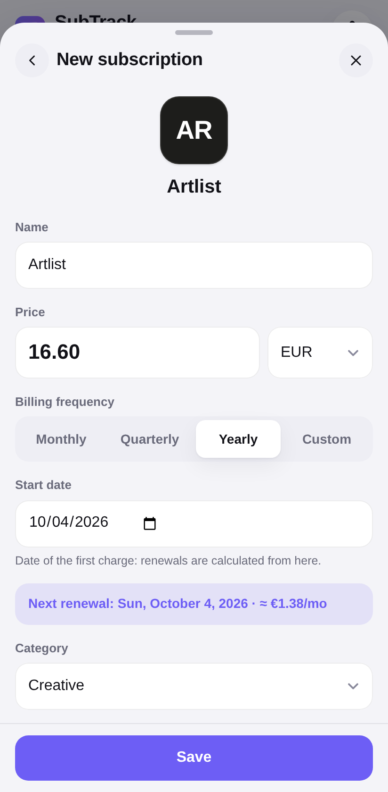
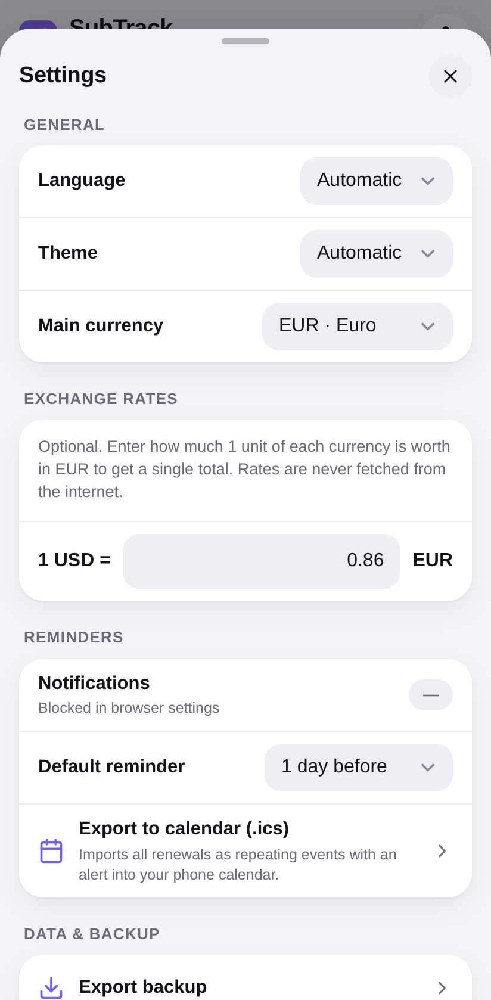
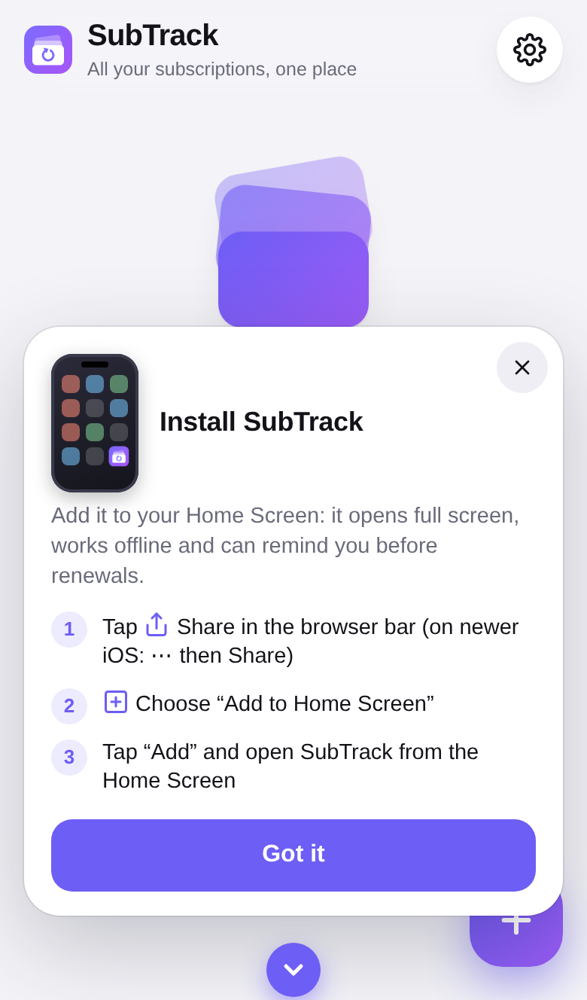

<div align="center">



# SubTrack

**Track all your subscriptions in one place: private, offline-first, installable.**

[](https://github.com/lestolo/subscription-tracker/actions/workflows/ci.yml)
[](LICENSE)


**English** · [Italiano](README.it.md)





</div>

## Table of contents

- [Features](#features)
- [Quick start](#quick-start)
- [Deploy](#deploy)
- [How reminders work](#how-reminders-work)
- [Privacy and security](#privacy-and-security)
- [Project structure](#project-structure)
- [Development](#development)
- [Contributing](#contributing)
- [Credits and trademarks](#credits-and-trademarks)
- [License](#license)

## Features

- **Catalogue of ~120 popular services** with logos: Netflix, Disney+, Amazon Prime, Spotify, iCloud+, Google One, Microsoft 365, Adobe Creative Cloud, ChatGPT, Claude, PlayStation Plus, Italian telcos and more, grouped by category with instant search.
- **Custom subscriptions**: any name, your own colour and an automatic monogram.
- **Flexible billing**: monthly, quarterly or yearly, or any custom period ("every 4 months", "every 2 weeks", …). Month-end dates are handled correctly (31 Jan → 28/29 Feb → 31 Mar).
- **Multi-currency**: each subscription has its own currency. Totals are shown per currency, or as one total in your main currency if you enter your own exchange rates (rates are never fetched online).
- **Dashboard**: monthly or yearly spend, upcoming renewals for the next 30 days, sorting by renewal date, cost or name, and pausing a subscription without deleting it.
- **Payment history**: past charges are calculated automatically, and you can confirm the amount actually paid or mark a charge as not charged. Price changes apply from a date of your choice, so the history stays accurate. An "Actual spending" chart shows the last 12 months.
- **Reminders**: local notifications plus a **calendar export (.ics)** with alerts for reliable reminders on any phone.
- **Installable PWA**: works offline and opens full screen. An animated guide shows how to add the app to the Home Screen on iOS and Android.
- **Bilingual UI**: Italian and English, detected automatically and switchable.
- **Mobile-first UX**: bottom sheets with swipe to dismiss, large touch targets, haptics, safe-area support, light and dark themes, and `prefers-reduced-motion` support.
- **Backup**: export and import your data as JSON. Deleting has an undo.
- **Zero dependencies, zero build step**: plain HTML, CSS and JavaScript.

<div align="center">



</div>

## Quick start

Requirements: any static web server. For local development: [Node.js](https://nodejs.org) ≥ 20 (optional, only for the dev server and the tests).

```bash
git clone https://github.com/lestolo/subscription-tracker.git
cd subscription-tracker
npm start            # serves the app on http://localhost:8080
```

Any other static server works too, for example `python3 -m http.server 8080`.

> Service workers and notifications need a **secure context**: `http://localhost` works for development, but a real deployment must use **HTTPS**.

## Deploy

The app is a folder of static files with no build step and no environment variables.

### Vercel

[](https://vercel.com/new/clone?repository-url=https%3A%2F%2Fgithub.com%2Flestolo%2Fsubscription-tracker)

1. Import the repository in Vercel.
2. Framework preset: **Other**. Build command: *none*. Output directory: `.` (root).
3. Deploy. [`vercel.json`](vercel.json) already sets the security headers (CSP, HSTS and others) and the right caching for `sw.js`.

### Self-hosting

Copy the repository contents (excluding `tests/`, `tools/`, `docs/` and `.github/` if you like) to any HTTPS static host: GitHub Pages, Netlify, Cloudflare Pages, nginx, Apache or Caddy. All paths are relative, so the app also works from a sub-folder (for example `https://example.com/subtrack/`).

Recommended server settings:

- serve `sw.js` with `Cache-Control: no-cache`;
- serve `manifest.webmanifest` as `application/manifest+json`;
- send the same security headers as [`vercel.json`](vercel.json).

<details>
<summary>Example nginx configuration</summary>

```nginx
server {
    listen 443 ssl http2;
    server_name subtrack.example.com;
    root /var/www/subtrack;

    add_header Content-Security-Policy "default-src 'self'; script-src 'self'; style-src 'self'; img-src 'self' data: blob:; connect-src 'self'; manifest-src 'self'; worker-src 'self'; object-src 'none'; base-uri 'self'; form-action 'self'; frame-ancestors 'none'" always;
    add_header X-Content-Type-Options nosniff always;
    add_header Referrer-Policy no-referrer always;

    location = /sw.js { add_header Cache-Control "no-cache"; }
    location ~ \.webmanifest$ { default_type application/manifest+json; }
}
```

</details>

## How reminders work

SubTrack has **no backend**, so it does not use Web Push (which needs a server and VAPID keys). Reminders are computed on the device instead:

| Mechanism | When it fires | Platforms |
| --- | --- | --- |
| Check on app open or resume | Every time you open or return to the app | All browsers that support notifications |
| Periodic Background Sync | In the background, about every 12 hours, at the browser's discretion | Chromium on Android, installed app only |
| **Calendar export (.ics)** | At 09:00 on the reminder day, handled by your calendar app | Every phone and desktop calendar |

Each renewal is notified **only once**. On **iPhone/iPad**, notifications for web apps need iOS/iPadOS 16.4 or later and the app must be **added to the Home Screen** first. The in-app guide walks you through this.

For reminders that always arrive on time, use **Settings → Export to calendar**: each subscription becomes a repeating event with an alert, and month-end dates are handled correctly.

## Privacy and security

- **Your data stays on your device**, in IndexedDB. There are no accounts, no analytics, no cookies and no third-party requests.
- All assets, including logos, are bundled locally. The app makes no network calls besides loading its own files.
- A strict **Content Security Policy** blocks inline scripts and external origins. User input is only ever rendered as text, and imported backups are validated field by field.
- **Clearing the browser's site data deletes your subscriptions.** Export a backup from time to time.
- The repository contains no secrets, API keys or personal data. Please keep it that way in contributions; see [SECURITY.md](SECURITY.md).

## Project structure

```
├── index.html              App shell
├── manifest.webmanifest    PWA manifest
├── sw.js                   Service worker (offline cache, background reminders)
├── vercel.json             Hosting headers for Vercel
├── css/app.css             All styles (light and dark themes, animations)
├── js/
│   ├── core/               DOM-free logic, shared by the page, the service worker and the tests
│   │   ├── catalog.js      Service catalogue (name, category, brand colour, icon)
│   │   ├── icons.js        Brand icons (generated from Simple Icons)
│   │   ├── schedule.js     Billing-date maths
│   │   ├── i18n.js         Translations (IT/EN) and formatting
│   │   ├── db.js           IndexedDB storage, validation, backup
│   │   ├── reminders.js    Local notifications
│   │   ├── ics.js          Calendar export
│   │   ├── history.js      Payment history and actual spending
│   │   └── version.js      App version (also names the offline cache)
│   ├── ui.js               DOM helpers, bottom sheets, toasts
│   ├── install.js          "Add to Home Screen" guide
│   └── app.js              Application controller
├── icons/                  App icons
├── tests/                  Unit tests (node:test)
└── tools/build-icons.mjs   Regenerates js/core/icons.js
```

## Development

```bash
npm test             # runs the unit tests (no install needed)
npm start            # local dev server
```

**Adding a service to the catalogue:** add a line to `RAW` in [`js/core/catalog.js`](js/core/catalog.js). If the brand exists on [simpleicons.org](https://simpleicons.org), set its slug and run `npm run icons` to embed the logo. Otherwise use `null` and a monogram is shown.

**Adding a language:** copy the `en` block in [`js/core/i18n.js`](js/core/i18n.js), translate it and add the code to `LANGS`. A test checks that all languages have the same keys.

**Releasing:** bump `ST.VERSION` in [`js/core/version.js`](js/core/version.js). This renames the offline cache, so installed apps pick up the new files and show a "New version available" prompt.

## Contributing

Contributions are welcome. Please read [CONTRIBUTING.md](CONTRIBUTING.md) and our [Code of Conduct](CODE_OF_CONDUCT.md). Report bugs and ideas through [GitHub Issues](https://github.com/lestolo/subscription-tracker/issues).

## Credits and trademarks

- Brand icons come from [Simple Icons](https://simpleicons.org) (CC0-1.0).
- All product names, logos and brands are property of their respective owners. They are used here only to identify services, and their use does not imply endorsement. Brands not available in Simple Icons are shown as a coloured monogram.
- SubTrack is an independent project and is not affiliated with any of the listed services.

## License

[MIT](LICENSE)
